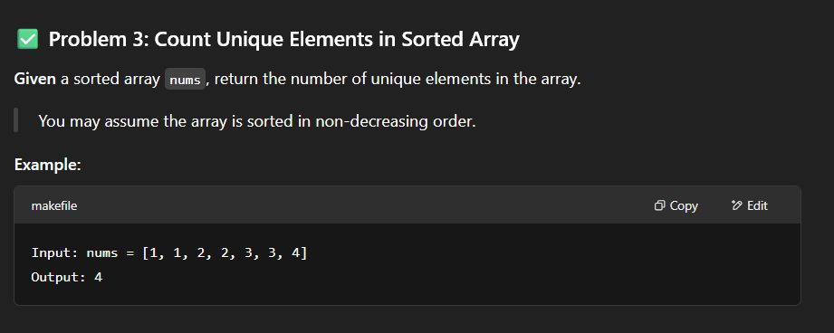

# Count unique elements in sorted array

- `sol1.py` - In this solution **set-based** check is performed. It is a **constant-time** operation -> ` O(1)`, average-case due to hashing. But along with a new list, a new set is also created. But effective when the length of the input list is very high.
  Overall time complexity: O(N)

- `sol2.py` - In this solution **list-based** check is performed. It is a linear-search operation ->
  `O(N)`. But only new list is created and not a set.
  Overall time complexity: O(N2).
