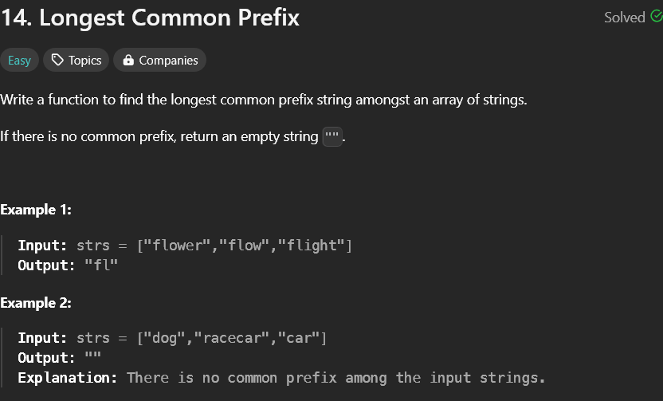

# Longest common prefix

## My solution

- `sol1.py` - This was my initial solution which passed 120/126 test cases and failed in the some.
  For the input `["car","cir"]`, the prefix returned was `cr`, but the expected output should have been `c`.
- `final_sol.py` - This is my final solution, where I modified my code a bit and it passed all the test cases.
