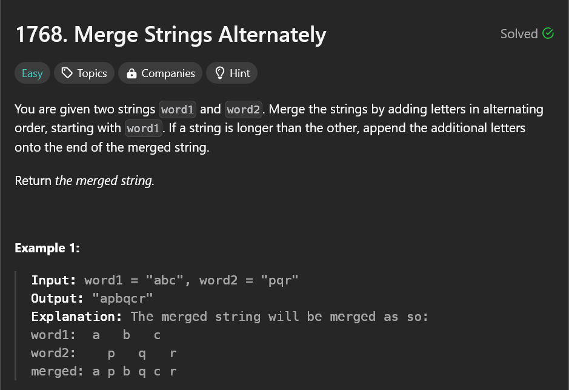

# TO merge the strings alternately

## My solutions

-`sol1.py` - A basic implementation using direct string concatenation to merge two strings.

-`final_sol.py` - An optimized solution using a list to build the final string, significantly improving time and space efficiency.
