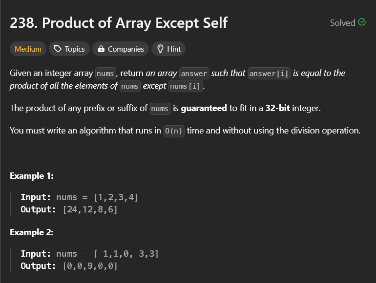

# product of Array except self

## My solutions

- `sol1.py` - This code has a time complexity of O(N2).

- `final.py` - This code has a time complexity of O(N). I have used Prefix-Suffix method for multiplication.
