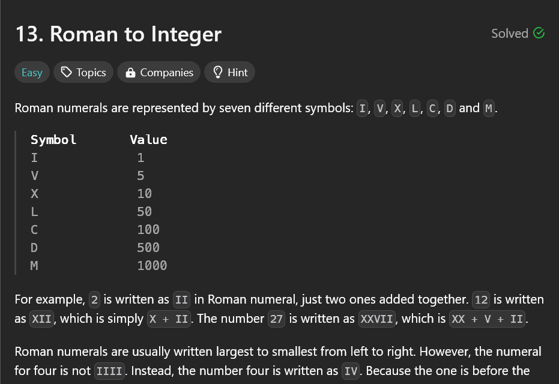
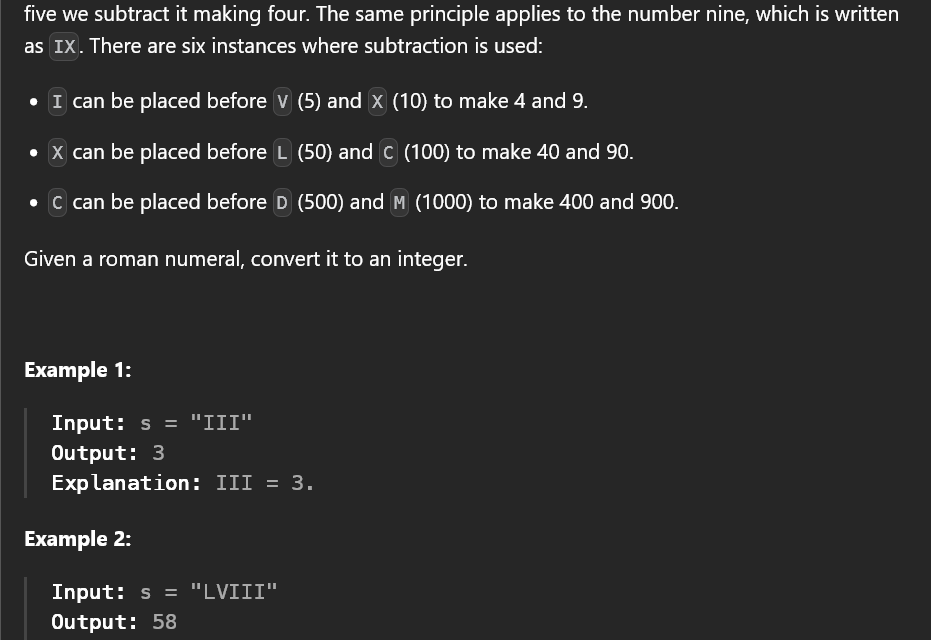

# To convert Roman number to Integer

## My solution

- `sol1_final` - This is my first and final solution which is efficient in terms of time and space complexity.

- `Key learning` - Python treats `or` with lower precedence than `and`.
