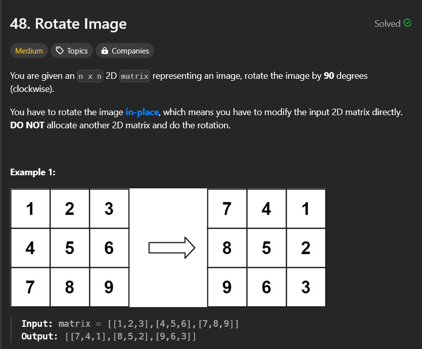

# Rotate Image

# My solutions

- `sol1.py` - This code uses single-pass but requires a new list to store the result.

- `final.py`- This code also uses single-pass but performs **in-place** modification of the input list.
