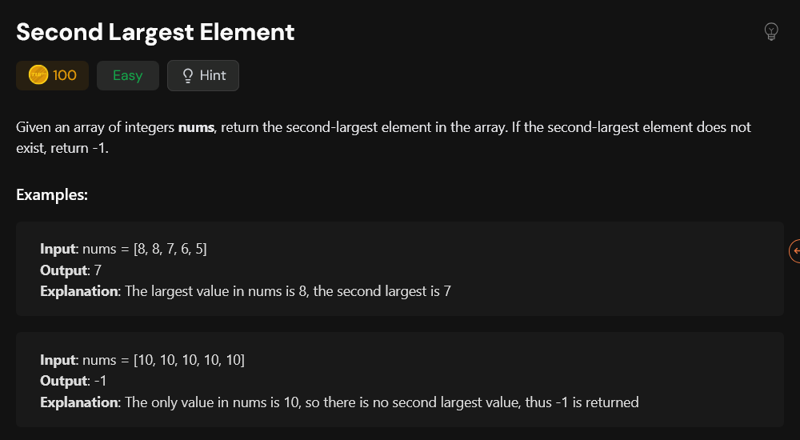

# Finding the second largest element without sorting an array

- `sol1.py` - This code uses `multi-pass linear scan algorithm` but still has a time complexity of O(N). But here `in-place` modification of input list is not recommended.(I will modify it later)
- `final.py` - This code uses ` single-pass linear scan algorithm`. Time complexity is O(N).

Both the solutions handles the edge cases effectively.
