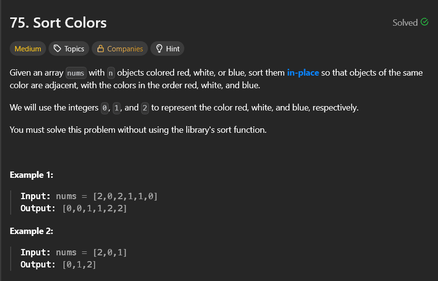

# Sort Colors

- `sol.py` - This code only works for the input which consists 0,1,2. If any of them is not present, error occurs.

- `sol1.py` - This code works even if any color/num is missing. The `.get()` method is used to **safely retrieve the value** from the dictionary.
